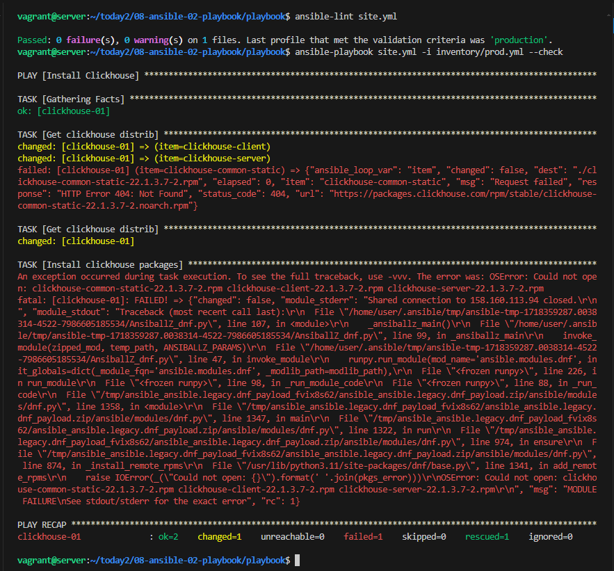
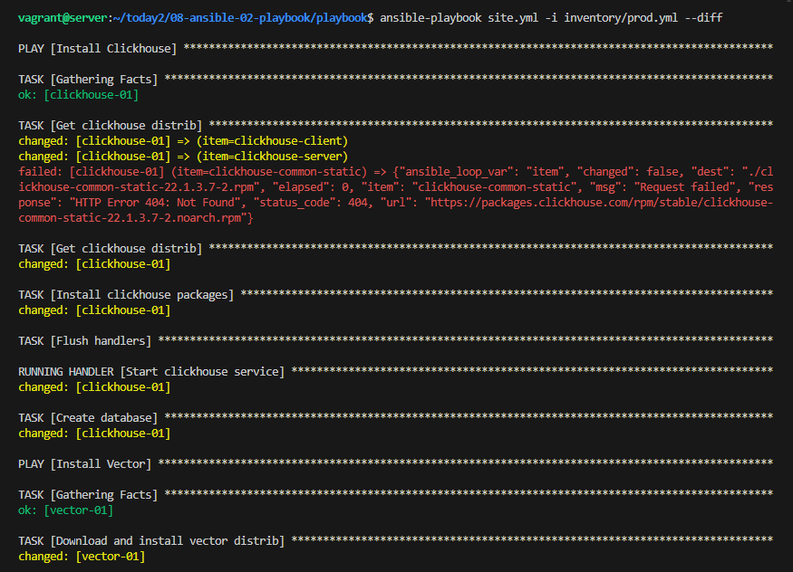

# Домашнее задание к занятию 2 «Работа с Playbook»

## Подготовка к выполнению

1. * Необязательно. Изучите, что такое [ClickHouse](https://www.youtube.com/watch?v=fjTNS2zkeBs) и [Vector](https://www.youtube.com/watch?v=CgEhyffisLY).
2. Создайте свой публичный репозиторий на GitHub с произвольным именем или используйте старый.
3. Скачайте [Playbook](./playbook/) из репозитория с домашним заданием и перенесите его в свой репозиторий.
4. Подготовьте хосты в соответствии с группами из предподготовленного playbook.

## Основная часть

1. Подготовьте свой inventory-файл `prod.yml`.
2. Допишите playbook: нужно сделать ещё один play, который устанавливает и настраивает [vector](https://vector.dev). Конфигурация vector должна деплоиться через template файл jinja2. От вас не требуется использовать все возможности шаблонизатора, просто вставьте стандартный конфиг в template файл. Информация по шаблонам по [ссылке](https://www.dmosk.ru/instruktions.php?object=ansible-nginx-install). не забудьте сделать handler на перезапуск vector в случае изменения конфигурации!
3. При создании tasks рекомендую использовать модули: `get_url`, `template`, `unarchive`, `file`.
4. Tasks должны: скачать дистрибутив нужной версии, выполнить распаковку в выбранную директорию, установить vector.
5. Запустите `ansible-lint site.yml` и исправьте ошибки, если они есть.
6. Попробуйте запустить playbook на этом окружении с флагом `--check`.
7. Запустите playbook на `prod.yml` окружении с флагом `--diff`. Убедитесь, что изменения на системе произведены.
8. Повторно запустите playbook с флагом `--diff` и убедитесь, что playbook идемпотентен.
9. Подготовьте README.md-файл по своему playbook. В нём должно быть описано: что делает playbook, какие у него есть параметры и теги. Пример качественной документации ansible playbook по [ссылке](https://github.com/opensearch-project/ansible-playbook). Так же приложите скриншоты выполнения заданий №5-8
10. Готовый playbook выложите в свой репозиторий, поставьте тег `08-ansible-02-playbook` на фиксирующий коммит, в ответ предоставьте ссылку на него.

---

### Решение

Используя [Terraform](./terraform) развернем инфраструтуру из двух вм. IP пробросим в inventory из template.

Вносим все необходимые изменения в [Playbook](./playbook/site.yml)

Исправляем все огрехи и запускаем `ansible-lint site.yml` , после пробуем запустить playbook на этом окружении с флагом `--check`.

Вероятно, ошибка связанна с разными версиями python3. На control node установлена версия 3.10 , а на managed node 3.11.

Запускаем с с флагом `--diff` , видим ,что все устновилось.

Повторно запускаем playbook с флагом `--diff` - идемпотентность "в чистом виде". 

Пробуем повторно запустить с флагом `--check`

Проверим все устновилось верно:

### Ansible-clickhouse-vector
---
Простейший плейбук для установки Clickhouse и Vector.

### Требования
---

#### Ansible2.17
#### Python3.10
#### Fedora37 (Vm's OS)

### Установка
---

`ansible-playbook site.yml -i inventory/prod.yml`

Примечание: 
Данный плейбок использовался для установки ПО на раздельных хостах(вм) , созданных в yandex.cloud.
Для увеличения контролируемых хостов или установки на 1 хост нужно внести изменения в `inventory/prod.yml`.

### Переменные
---
Используются следующие переменные:

- clickhouse_version  -  версия Clickhouse
- clickhouse_packages -  необходимые пакеты
- vector_version      -  версия Vector
- clickhouse_ip       -  внешний ip вм, на которой установлен Clickhouse , для файла конфигурации vector.toml 

### Файлы конфигурации
---
vector.service.j2 - шаблон для настройки сервиса Vector.

vector.toml.j2 - шаблон файла конфигурации Vector.

