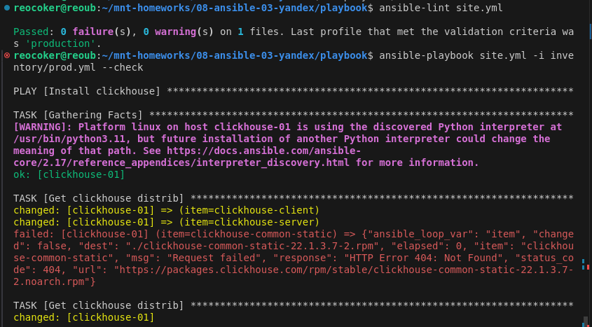

# Домашнее задание к занятию 3 «Использование Ansible»

## Подготовка к выполнению

1. Подготовьте в Yandex Cloud три хоста: для `clickhouse`, для `vector` и для `lighthouse`.
2. Репозиторий LightHouse находится [по ссылке](https://github.com/VKCOM/lighthouse).

## Основная часть

1. Допишите playbook: нужно сделать ещё один play, который устанавливает и настраивает LightHouse.
2. При создании tasks рекомендую использовать модули: `get_url`, `template`, `yum`, `apt`.
3. Tasks должны: скачать статику LightHouse, установить Nginx или любой другой веб-сервер, настроить его конфиг для открытия LightHouse, запустить веб-сервер.
4. Подготовьте свой inventory-файл `prod.yml`.
5. Запустите `ansible-lint site.yml` и исправьте ошибки, если они есть.
6. Попробуйте запустить playbook на этом окружении с флагом `--check`.
7. Запустите playbook на `prod.yml` окружении с флагом `--diff`. Убедитесь, что изменения на системе произведены.
8. Повторно запустите playbook с флагом `--diff` и убедитесь, что playbook идемпотентен.
9. Подготовьте README.md-файл по своему playbook. В нём должно быть описано: что делает playbook, какие у него есть параметры и теги.
10. Готовый playbook выложите в свой репозиторий, поставьте тег `08-ansible-03-yandex` на фиксирующий коммит, в ответ предоставьте ссылку на него.

---
## Решение

Используя [Terraform](./terraform) развернем инфраструтуру из трех вм. IP пробросим в inventory из template.

Вносим все необходимые изменения в [Playbook](./playbook/site.yml)

Запускаем `ansible-lint site.yml` , после пробуем запустить playbook на этом окружении с флагом `--check`,который стопится на установке пакетов.

Запускаем плейбук с флагом `--diff` дважды - изменений нет.

Проверим LightHouse :

### Ansible-clickhouse-vector
---
Простейший плейбук для установки Clickhouse, Vector и LightHouse.

### Требования
---

#### Ansible2.17
#### Python3.10
#### Fedora37 (Vm's OS)

### Установка
---

`ansible-playbook site.yml -i inventory/prod.yml`

Примечание: 
Данный плейбук использовался для установки ПО на раздельных хостах(вм) , созданных в yandex.cloud.
Для увеличения контролируемых хостов или установки на 1 хост нужно внести изменения в `inventory/prod.yml`.

### Тэги
---

Плейбук разбит на 4 таски , каждую из которых можно выполнить отдельно , используя соответствующий тэг:

- Clickhouse
- Vector
- LightHouse
- Nginx

### Переменные
---
Используются следующие переменные:

- clickhouse_version    -  версия Clickhouse
- clickhouse_packages   -  необходимые пакеты
- vector_version        -  версия Vector
- clickhouse_ip         -  внешний ip вм, на которой установлен Clickhouse , для файла конфигурации vector.toml
- lighthouse_nginx_user -  пользователь для взаимодействия с Nginx

### Файлы конфигурации
---
vector.service.j2  - шаблон для настройки сервиса Vector.

vector.toml.j2     - шаблон файла конфигурации Vector.

nginx.conf.j2      - шаблон файла конфигурации Nginx.

lighthouse.conf.j2 - шаблон файла конфигурации взаимодействия Nginx и LightHouse.

