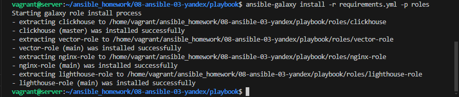
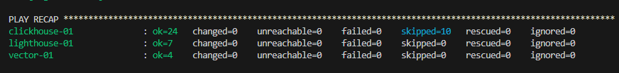
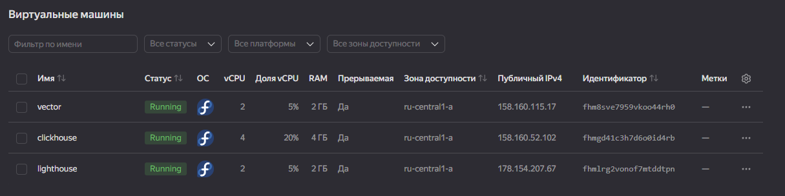
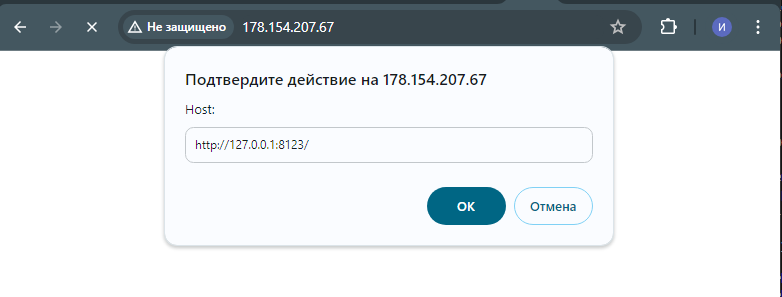
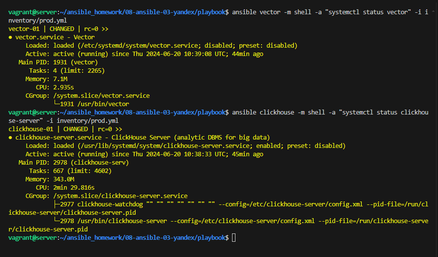

# Домашнее задание к занятию 4 «Работа с roles»

## Подготовка к выполнению

1. * Необязательно. Познакомьтесь с [LightHouse](https://youtu.be/ymlrNlaHzIY?t=929).
2. Создайте два пустых публичных репозитория в любом своём проекте: vector-role и lighthouse-role.
3. Добавьте публичную часть своего ключа к своему профилю на GitHub.

## Основная часть

Ваша цель — разбить ваш playbook на отдельные roles.

Задача — сделать roles для ClickHouse, Vector и LightHouse и написать playbook для использования этих ролей.

Ожидаемый результат — существуют три ваших репозитория: два с roles и один с playbook.

**Что нужно сделать**

1. Создайте в старой версии playbook файл `requirements.yml` и заполните его содержимым:

   ```yaml
   ---
     - src: git@github.com:AlexeySetevoi/ansible-clickhouse.git
       scm: git
       version: "1.13"
       name: clickhouse 
   ```

2. При помощи `ansible-galaxy` скачайте себе эту роль.
3. Создайте новый каталог с ролью при помощи `ansible-galaxy role init vector-role`.
4. На основе tasks из старого playbook заполните новую role. Разнесите переменные между `vars` и `default`.
5. Перенести нужные шаблоны конфигов в `templates`.
6. Опишите в `README.md` обе роли и их параметры. Пример качественной документации ansible role [по ссылке](https://github.com/cloudalchemy/ansible-prometheus).
7. Повторите шаги 3–6 для LightHouse. Помните, что одна роль должна настраивать один продукт.
8. Выложите все roles в репозитории. Проставьте теги, используя семантическую нумерацию. Добавьте roles в `requirements.yml` в playbook.
9. Переработайте playbook на использование roles. Не забудьте про зависимости LightHouse и возможности совмещения `roles` с `tasks`.
10. Выложите playbook в репозиторий.
11. В ответе дайте ссылки на оба репозитория с roles и одну ссылку на репозиторий с playbook.

---

### Решение

Используя [Terraform](./terraform) развернем инфраструтуру из трех вм. IP пробросим в inventory из template.

Добавляем все необходимые roles в `requirements.yml` в playbook и перерабатываем его [playbook](./playbook) .

Проверим :

- скачиваем роли:



- запускаем ansible-playbook:



- проверяем ,что все запустилось:





Созданные роли:

- [Vector-role](https://github.com/reocoker85/vector-role.git)
- [Lighthouse-role](https://github.com/reocoker85/lighthose-role.git)
- [Nginx-role](https://github.com/reocoker85/nginx-role.git)
