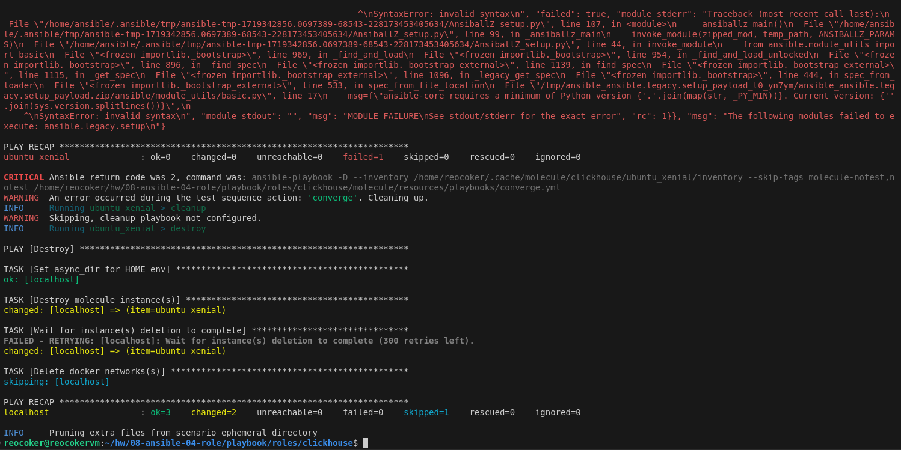
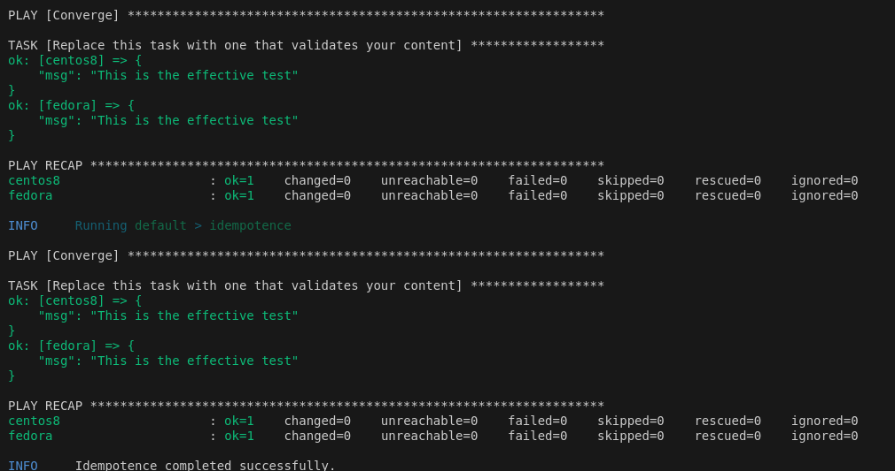
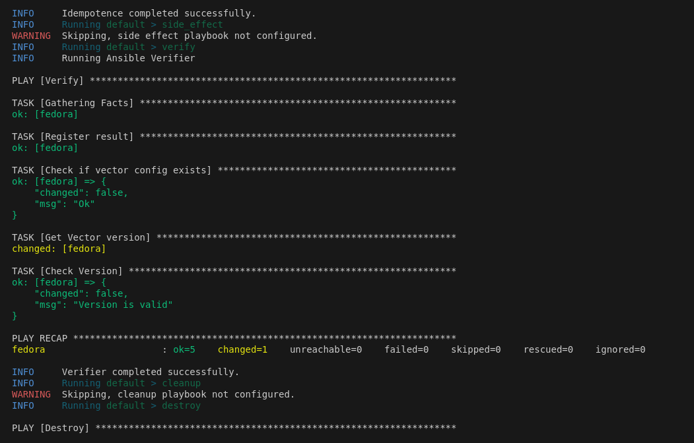
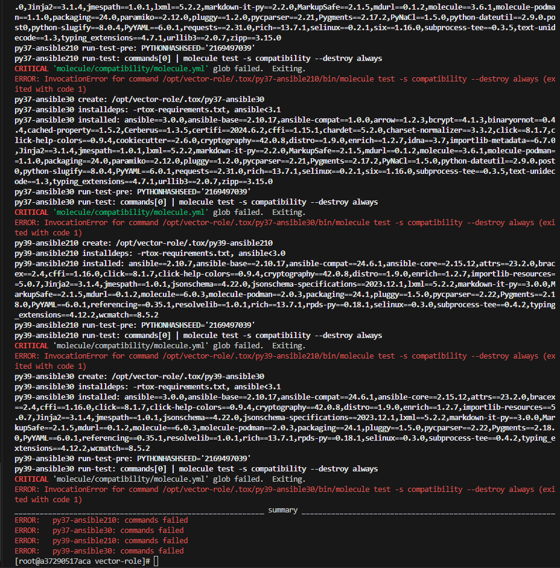
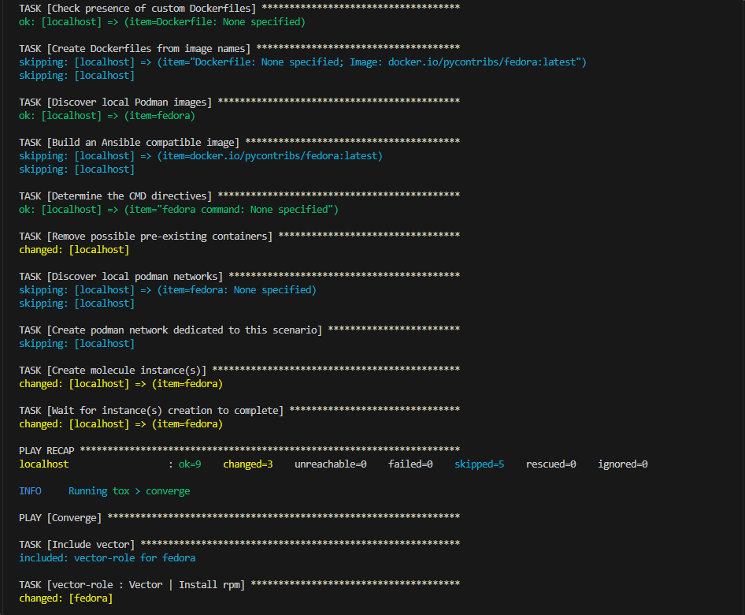
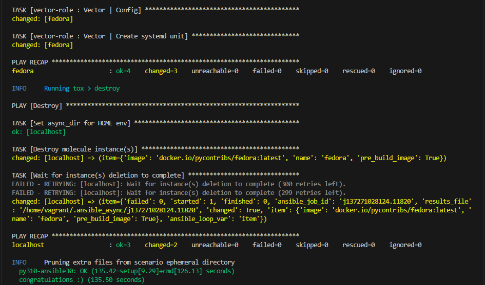

# Домашнее задание к занятию 5 «Тестирование roles»

## Подготовка к выполнению

1. Установите molecule и его драйвера: `pip3 install "molecule molecule_docker molecule_podman`.
2. Выполните `docker pull aragast/netology:latest` —  это образ с podman, tox и несколькими пайтонами (3.7 и 3.9) внутри.

## Основная часть

Ваша цель — настроить тестирование ваших ролей. 

Задача — сделать сценарии тестирования для vector. 

Ожидаемый результат — все сценарии успешно проходят тестирование ролей.

### Molecule

1. Запустите  `molecule test -s ubuntu_xenial` (или с любым другим сценарием, не имеет значения) внутри корневой директории clickhouse-role, посмотрите на вывод команды. Данная команда может отработать с ошибками или не отработать вовсе, это нормально. Наша цель - посмотреть как другие в реальном мире используют молекулу И из чего может состоять сценарий тестирования.
2. Перейдите в каталог с ролью vector-role и создайте сценарий тестирования по умолчанию при помощи `molecule init scenario --driver-name docker`.
3. Добавьте несколько разных дистрибутивов (oraclelinux:8, ubuntu:latest) для инстансов и протестируйте роль, исправьте найденные ошибки, если они есть.
4. Добавьте несколько assert в verify.yml-файл для  проверки работоспособности vector-role (проверка, что конфиг валидный, проверка успешности запуска и др.). 
5. Запустите тестирование роли повторно и проверьте, что оно прошло успешно.
5. Добавьте новый тег на коммит с рабочим сценарием в соответствии с семантическим версионированием.

### Tox

1. Добавьте в директорию с vector-role файлы из [директории](./example).
2. Запустите `docker run --privileged=True -v <path_to_repo>:/opt/vector-role -w /opt/vector-role -it aragast/netology:latest /bin/bash`, где path_to_repo — путь до корня репозитория с vector-role на вашей файловой системе.
3. Внутри контейнера выполните команду `tox`, посмотрите на вывод.
5. Создайте облегчённый сценарий для `molecule` с драйвером `molecule_podman`. Проверьте его на исполнимость.
6. Пропишите правильную команду в `tox.ini`, чтобы запускался облегчённый сценарий.
8. Запустите команду `tox`. Убедитесь, что всё отработало успешно.
9. Добавьте новый тег на коммит с рабочим сценарием в соответствии с семантическим версионированием.

После выполнения у вас должно получится два сценария molecule и один tox.ini файл в репозитории. Не забудьте указать в ответе теги решений Tox и Molecule заданий. В качестве решения пришлите ссылку на  ваш репозиторий и скриншоты этапов выполнения задания. 

### Решение Molecule

Проверка дефолтной роли:

Проверка vector-role с  verify.yml:

[Vector_role_v1.0.1](https://github.com/reocoker85/vector-role/tree/v1.0.1)

### Решение Tox

[Vector_role_v1.0.2](https://github.com/reocoker85/vector-role/tree/v1.0.2)
